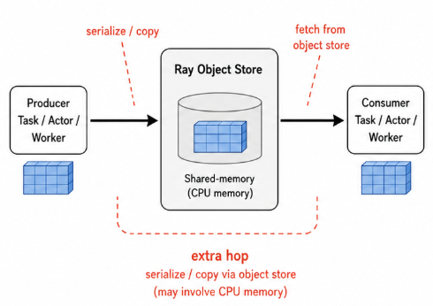
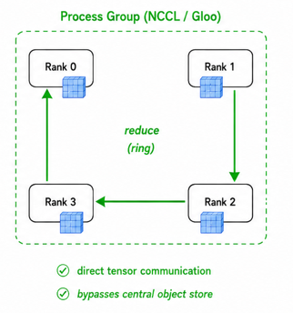
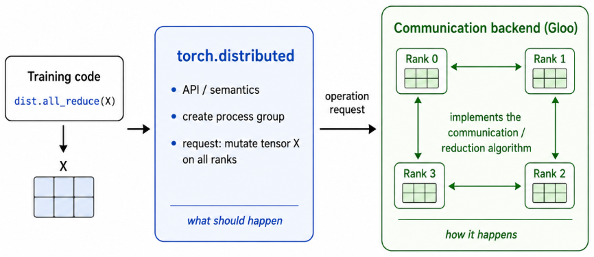
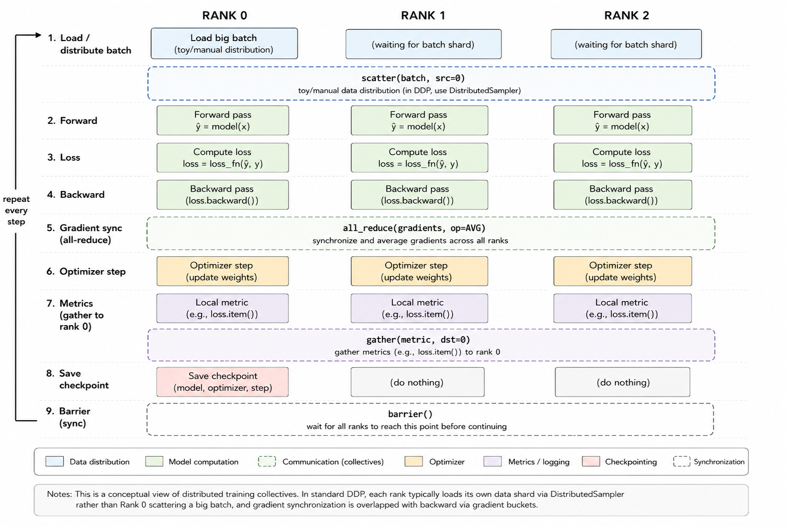

# Distributed DL Unit 1 - Collective Communication in PyTorch

## Setup

Complete [Dev Container Setup](../0_devcontainer_setup/0_devcontainer_setup.md) first.

1. Open Part 3 in VS Code:

   ```powershell
   cd Distributed_DL
   code .
   ```

2. Reopen the folder in the dev container:

   - open the Command Palette (`Ctrl+Shift+P`)
   - run `Dev Containers: Reopen in Container`

3. Activate the environment inside the container:

   ```bash
   conda activate 22971-td
   ```

4. Run all commands in this lesson from `/workspace` inside the container.

---

## Why `torch.distributed`?

Ray is excellent for orchestration and general distributed Python workloads, but it has a pain point: data moves only through the object store.



This is unsuitable for DL training because nodes must exchange tensors quickly.

`torch.distributed` exists for that job:

- it is built around training-oriented, fast low-level communication patterns with *distributed tensors*
- data movement and process synchronization become explicit
   - good for runtime optimization
   - bad for code simplicity



In this unit we use the CPU-friendly `gloo` backend.
Later GPU sections reuse the same mental model with faster GPU-oriented communication backends.

**Divison of labor:**




---

## Essential glossary

- **job**: the full distributed training run
- **node**: one machine participating in the job
- **process**: one Python worker started by the operating system
- **rank**: the global ID of one process in the job
- **local rank**: the process ID relative to one node
- **world_size**: the total number of processes in the job
- **world group**: the default process group containing every rank

**Key idea:** there is no shared memory across processes.
Each process owns its own tensors, so any data movement between ranks must be explicit.

### Minimal example

After running:

```bash
torchrun --standalone --nproc_per_node=4 training_job.py
```
`torchrun` launches four processes on one node and assigns ranks `0`, `1`, `2`, and `3`.

```text
training_job
|
+-- node A
    +-- process / rank 0
    +-- process / rank 1
    +-- process / rank 2
    +-- process / rank 3
```

Here:

- the job has `world_size = 4`
- the world group is `{0, 1, 2, 3}`
- rank `0` often handles extra coordination or logging by convention, but every rank still runs user code

Later, the same idea extends to multiple nodes: each node contributes more ranks, and `world_size` is still the total across the full job.

---

## Hello Ranks

Run:

```bash
torchrun --standalone --nproc_per_node=4 1_collective_communication/1_hello_ranks.py
```

Expected result:

- four worker processes start
- every process prints the same `world_size`
- every process prints a different `rank`
- every process prints its own local tensor

What to notice:

- we launched one Python file
- `torchrun` launched four workers
- each worker ran the same code with different process-local state
- `LOCAL_RANK` and `rank` are related, but they are not always the same in multi-node jobs
- the code is shared, but each rank has its own local state and data

---

## Point-to-point with `send` and `recv`

Before collectives, it helps to see the most direct communication pattern.

Run:

```bash
torchrun --standalone --nproc_per_node=2 1_collective_communication/2_send_recv_demo.py
```

Expected result:

- rank `0` sends a tensor with value `1.0`
- rank `1` receives that tensor

What to notice:

- one `send` matches one `recv`
- both sides block by default until the transfer is complete
- if ranks disagree on the order or count of sends and receives, they can hang


---

## Collective communication cheat sheet

| Operation | What it does | Common use in a training loop |
|---|---|---|
| `broadcast` | one rank sends the same tensor to everyone | rank `0` loads a checkpoint and broadcasts the model weights to every worker |
| `reduce` | combine tensors onto one destination rank | every rank sends its validation loss to rank `0`, and only rank `0` logs the total |
| `all_reduce` | combine tensors and give the result to everyone | after `loss.backward()`, gradients are summed or averaged so every rank applies the same optimizer step |
| `gather` | collect tensors onto one destination rank | each rank sends one loss or accuracy value to rank `0` for printing |
| `all_gather` | collect tensors onto every rank | in contrastive training, each rank gathers embeddings from every worker so the loss can use the full global batch |
| `scatter` | one rank sends one piece to each rank | rank `0` splits one big batch into per-rank shards and sends one shard to each worker |
| `barrier` | wait until everyone reaches the same point | all ranks wait for rank `0` to finish saving a checkpoint before the next phase starts |

What to notice:

- `broadcast`, `reduce`, `gather`, and `scatter` are root-heavy: one rank has a special source or destination role
- `all_reduce`, `all_gather`, and `barrier` are more symmetric across ranks
- by default, these operations block at the call site; async variants exist and we preview them at the end

See the diagrams in the [PyTorch tutorial](https://docs.pytorch.org/tutorials/intermediate/dist_tuto.html#collective-communication).

---
## Basic distributed training loop (data parallelism)



## Contract of collectives

All participating ranks in the group must:

- call the same collective
- call those collectives in the same order
- use compatible tensor shapes
- use compatible tensor dtypes
- agree on details such as the source rank, destination rank, or list length when the API requires it

If one rank does something different, the others can block forever.

---

## Exercises

1. Explore point-to-point antipatterns and failure modes.
   Start from `2_send_recv_demo.py`, then try variants such as rank `0` doing `send` while rank `1` does `irecv`.
   Observe which versions complete, which versions need an explicit `wait()`, and which versions hang because the ranks no longer agree on the communication contract.

2. Explore async communication and unsafe mid-flight tensor access.
   Write a tiny `isend` / `irecv` demo, then intentionally read or overwrite the tensor before `wait()` completes.
   Record what behavior is still well-defined and what behavior becomes unsafe once the transfer is still in flight.

3. Explore shape and dtype mismatch.
   Make one rank send a tensor whose shape or dtype does not match the receive buffer, then write down what error or failure mode you see.
